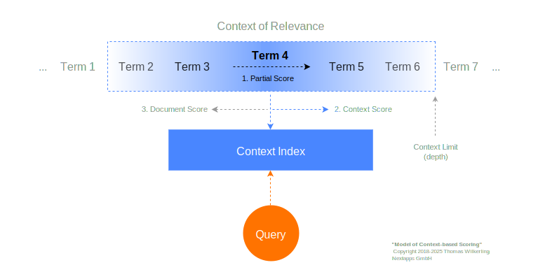

<!-- FlexSearch v0.8: [Overview and Migration Guide](doc/0.8.0.md) -->
Getting instant help by the DeepWiki AI assistant:

[](https://deepwiki.com/nextapps-de/flexsearch)

<h2></h2>
<h1>
    
    <p></p>
</h1>
<h3>Next-Generation full-text search library for Browser and Node.js</h3>

<a target="_blank" href="https://www.npmjs.com/package/flexsearch"></a>
<a target="_blank" href="https://github.com/nextapps-de/flexsearch/actions"></a>

<!--<a target="_blank" href="https://github.com/nextapps-de/flexsearch/issues"></a>-->
<a target="_blank" href="https://github.com/nextapps-de/flexsearch/blob/master/LICENSE"></a>

[Basic Start](#load-library) &ensp;&bull;&ensp; 
[API Reference](#api-overview) &ensp;&bull;&ensp;
[Encoder](doc/encoder.md) &ensp;&bull;&ensp;
[Document Search](doc/document-search.md) &ensp;&bull;&ensp;
[Persistent Indexes](doc/persistent.md) &ensp;&bull;&ensp;
[Using Worker](doc/worker.md) &ensp;&bull;&ensp;
[Tag Search](doc/document-search.md#tag-search) &ensp;&bull;&ensp;
[Highlighting](doc/result-highlighting.md) &ensp;&bull;&ensp;
[Resolver](doc/resolver.md) &ensp;&bull;&ensp;
[Changelog](CHANGELOG.md)

## Please Support this Project

FlexSearch has been helping developers around the world build powerful, efficient search functionalities for years. Maintaining and improving the library requires significant time and resources. If you’ve found this project valuable and you're interested in supporting the project, please consider donating. Thanks a lot for your continued support!

<a href="https://opencollective.com/flexsearch/donate" target="_blank" style="margin-right: 10px"></a>
<a href="https://github.com/sponsors/ts-thomas/" target="_blank" style="margin-right: 10px"></a>
<a href="https://liberapay.com/ts-thomas/donate" target="_blank" style="margin-right: 10px"></a>
<a href="https://www.patreon.com/user?u=96245532" target="_blank" style="margin-right: 10px"></a>
<a href="https://salt.bountysource.com/teams/ts-thomas" target="_blank" style="margin-right: 10px"></a>
<a href="https://www.paypal.com/donate/?hosted_button_id=GEVR88FC9BWRW" target="_blank"></a>

### FlexSearch Sponsors

<a href="https://antithesis.com" target="_blank" style="display: inline-block">
    <center>
        <br>
        Antithesis Operations LLC
    </center>
</a>
<h1></h1>

FlexSearch performs queries up to 1,000,000 times faster <a href="https://nextapps-de.github.io/flexsearch/" target="_blank">compared to other libraries</a> by also providing <a href="https://nextapps-de.github.io/flexsearch/match.html" target="_blank">powerful search capabilities</a> like multi-field search (document search), phonetic transformations, partial matching, tag-search, result highlighting or suggestions.

Bigger workloads are scalable through workers to perform any updates or queries to the index in parallel through dedicated balanced threads.

The latest generation v0.8 introduce [Persistent Indexes](doc/persistent.md), well optimized for scaling of large datasets and running in parallel. All available features was natively ported right into the database engine of your choice.

FlexSearch was nominated by the GitNation for the "Best Technology of the Year".

Supported Platforms:
- Browser
- Node.js

Supported Database:
- InMemory (Default)
- [IndexedDB (Browser)](doc/persistent-indexeddb.md)
- [Redis](doc/persistent-redis.md)
- [SQLite](doc/persistent-sqlite.md)
- [Postgres](doc/persistent-postgres.md)
- [MongoDB](doc/persistent-mongodb.md)
- [Clickhouse](doc/persistent-clickhouse.md)

Supported Charsets:
- Latin
- Chinese, Korean, Japanese (CJK)
- Hindi
- Arabic
- Cyrillic
- Greek and Coptic
- Hebrew

Common Code Examples:

- Node.js: [Module (ESM)](example/nodejs-esm)
- Node.js: [CommonJS](example/nodejs-commonjs)
- Browser: [Module (ESM)](example/browser-module)
- Browser: [Legacy Script](example/browser-legacy)

Demos:
- <a href="https://raw.githack.com/nextapps-de/flexsearch/master/demo/autocomplete.html" target="_blank">Auto-Complete</a>

<a name="benchmark"></a>
Benchmarks:
- <a href="https://nextapps-de.github.io/flexsearch/" target="_blank">Performance Benchmark</a>
- <a href="https://nextapps-de.github.io/flexsearch/match.html" target="_blank">Matching Benchmark</a>

<details>
<summary>Latest Benchmark Results</summary>
<br>
The benchmark was measured in terms per seconds, higher values are better (except the test "Memory").
The memory value refers to the amount of memory which was additionally allocated during search.<br>

<table>
    <tr></tr>
    <tr>
        <th>Library</th>
        <th>Memory</th>
        <th>Query: Single</th>
        <th>Query: Multi</th>
        <th>Query: Large</th>
        <th>Query: Not Found</th>
    </tr>
    <tr>
        <td>flexsearch</td>
        <td align="right">16</td>
        <td align="right">50955718</td>
        <td align="right">11912730</td>
        <td align="right">13981110</td>
        <td align="right">51706499</td>
    </tr>
    <tr></tr>
    <tr>
        <td>jsii</td>
        <td align="right">2188</td>
        <td align="right">13847</td>
        <td align="right">949559</td>
        <td align="right">1635959</td>
        <td align="right">3730307</td>
    </tr>
    <tr></tr>
    <tr>
        <td>wade</td>
        <td align="right">980</td>
        <td align="right">60473</td>
        <td align="right">443214</td>
        <td align="right">419152</td>
        <td align="right">1239372</td>
    </tr>
    <tr></tr>
    <tr>
        <td>js-search</td>
        <td align="right">237</td>
        <td align="right">22982</td>
        <td align="right">383775</td>
        <td align="right">426609</td>
        <td align="right">994803</td>
    </tr>
    <tr></tr>
    <tr>
        <td>minisearch</td>
        <td align="right">4777</td>
        <td align="right">30589</td>
        <td align="right">191657</td>
        <td align="right">5849</td>
        <td align="right">304233</td>
    </tr>
    <tr></tr>
    <tr>
        <td>orama</td>
        <td align="right">5355</td>
        <td align="right">29445</td>
        <td align="right">170231</td>
        <td align="right">4454</td>
        <td align="right">225491</td>
    </tr>
    <tr></tr>
    <tr>
        <td>elasticlunr</td>
        <td align="right">3073</td>
        <td align="right">14326</td>
        <td align="right">48558</td>
        <td align="right">101206</td>
        <td align="right">95840</td>
    </tr>
    <tr></tr>
    <tr>
        <td>lunr</td>
        <td align="right">2443</td>
        <td align="right">11527</td>
        <td align="right">51476</td>
        <td align="right">88858</td>
        <td align="right">103386</td>
    </tr>
    <tr></tr>
    <tr>
        <td>ufuzzy</td>
        <td align="right">13754</td>
        <td align="right">2799</td>
        <td align="right">7788</td>
        <td align="right">58544</td>
        <td align="right">9557</td>
    </tr>
    <tr></tr>
    <tr>
        <td>bm25</td>
        <td align="right">33963</td>
        <td align="right">3903</td>
        <td align="right">4777</td>
        <td align="right">12657</td>
        <td align="right">12471</td>
    </tr>
    <tr></tr>
    <tr>
        <td>fuzzysearch</td>
        <td align="right">300147</td>
        <td align="right">148</td>
        <td align="right">229</td>
        <td align="right">455</td>
        <td align="right">276</td>
    </tr>
    <tr></tr>
    <tr>
        <td>fuse</td>
        <td align="right">247107</td>
        <td align="right">422</td>
        <td align="right">321</td>
        <td align="right">337</td>
        <td align="right">329</td>
    </tr>
</table>

Run Comparison: <a href="https://nextapps-de.github.io/flexsearch/" target="_blank">Performance Benchmark "Gulliver's Travels"</a>

</details>

Extern Projects & Plugins:
- React: https://github.com/angeloashmore/react-use-flexsearch
- Vue: https://github.com/Noction/vue-use-flexsearch
- Gatsby: https://www.gatsbyjs.org/packages/gatsby-plugin-flexsearch/
- Nikola: https://plugins.getnikola.com/v8/flexsearch_plugin/

## Table of contents

> [!TIP]
> Understanding those 3 elementary things about FlexSearch will improve your results significantly: [Tokenizer](#tokenizer-partial-match), [Encoder](doc/encoder.md) and [Suggestions](#suggestions)

- [Load Library (Node.js, ESM, Legacy Browser)](#load-library)
  - [Non-Module Bundles (ES5 Legacy)](#non-module-bundles-es5-legacy)
  - [Module (ESM)](#module-esm)
  - [Node.js](#nodejs)
- [Basic Usage and Variants](#basic-usage-and-variants)
  - [Index Options](#index-options)
  - [Search Options](#search-options)
- [Common Code Examples (Browser, Node.js)](#common-code-examples)
- [API Overview](#api-overview)
- [Presets](#presets)
- [Context Search](#context-search)
  - [Context Options](#context-options)
- [Fast-Update Mode](#fast-update-mode)
- [Suggestions](#suggestions)
- [Document Search (Multi-Field Search)](doc/document-search.md)
  - [Document Index Options](doc/document-search.md#document-options)
  - [Document Descriptor](doc/document-search.md#the-document-descriptor)
  - [Document Search Options](doc/document-search.md#document-search-options)
  - [Multi-Tag Search](doc/document-search.md)
  - [Result Highlighting](doc/result-highlighting.md)
    - [Highlighting Options](doc/result-highlighting.md#highlighting-options)
      - [Boundary Options](doc/result-highlighting.md#highlighting-boundary-options)
      - [Ellipsis Options](doc/result-highlighting.md#highlighting-ellipsis-options)
- [Phonetic Search (Fuzzy Search)](#fuzzy-search)
- [Tokenizer (Partial Search)](#tokenizer-partial-match)
- [Charset Collection](#charset-collection)
- [Encoder](doc/encoder.md)
  - [Encoder Options](doc/encoder.md#encoder-options)
  - [Universal Charset Collection](doc/encoder.md)
  - [Latin Charset Encoder Presets](doc/encoder.md)
  - [Language Specific Preset](doc/encoder.md)
  - [Custom Encoder](doc/encoder.md#custom-encoder)
- [Async Non-Blocking Runtime Balancer](doc/async.md)
- [Worker Indexes](doc/worker.md)
  - [Worker Index Options](doc/worker.md#worker-index-options)
- [Resolver (Complex Queries)](doc/resolver.md)
  - [Resolver Options](doc/resolver.md)
  - [Boolean Operations (and, or, xor, not)](doc/resolver.md)
  - [Boost](doc/resolver.md)
  - [Limit / Offset](doc/resolver.md)
  - [Resolve](doc/resolver.md)
- [Auto-Balanced Cache by Popularity/Last Query](#auto-balanced-cache-by-popularity)
- [Export / Import Indexes](doc/export-import.md)
  - [Fast-Boot Serialization](doc/export-import.md#fast-boot-serialization-for-server-side-rendering-php-python-ruby-rust-java-go-nodejs-)
- [Persistent Indexes](doc/persistent.md)
  - [Persistent Index Options](doc/persistent.md)
  - [IndexedDB (Browser)](doc/persistent-indexeddb.md)
  - [Postgres](doc/persistent-postgres.md)
  - [Redis](doc/persistent-redis.md)
  - [MongoDB](doc/persistent-mongodb.md)
  - [SQLite](doc/persistent-sqlite.md)
  - [Clickhouse](doc/persistent-clickhouse.md)
- [Custom Score Function](doc/customization.md)
- [Custom Builds](doc/custom-builds.md)
- [Extended Keystores (In-Memory Index)](doc/keystore.md)
- [Best Practices](#best-practices)
  - [Page-Load / Fast-Boot](#page-load--fast-boot)
  - [Prefer numeric typed IDs](#use-numeric-ids)

## Load Library (Node.js, ESM, Legacy Browser)

```bash
npm install flexsearch
```

The **_dist_** folder is located in: `node_modules/flexsearch/dist/`

> It is not recommended to use the `/src/` folder of this repository as it requires some kind of conditional compilation to resolve the build flags. The `/dist/` folder contains every version you might need including unminified ES6 modules. When none of the `/dist/` folder versions works for you please open an issue. Alternatively you can read more about [Custom Builds](doc/custom-builds.md).

<details>
<summary>Download Builds</summary>
<br>
<table>
    <tr></tr>
    <tr>
        <td>Build</td>
        <td>File</td>
        <td>CDN</td>
    </tr>
    <tr>
        <td>flexsearch.bundle.min.js</td>
        <td><a href="https://github.com/nextapps-de/flexsearch/raw/0.8.2/dist/flexsearch.bundle.min.js" target="_blank">Download</a></td>
        <td><a href="https://cdn.jsdelivr.net/gh/nextapps-de/flexsearch@0.8.2/dist/flexsearch.bundle.min.js" target="_blank">https://cdn.jsdelivr.net/gh/nextapps-de/flexsearch@0.8.2/dist/flexsearch.bundle.min.js</a></td>
    </tr>
    <tr></tr>
    <tr>
        <td>flexsearch.bundle.debug.js</td>
        <td><a href="https://github.com/nextapps-de/flexsearch/raw/0.8.2/dist/flexsearch.bundle.debug.js" target="_blank">Download</a></td>
        <td><a href="https://cdn.jsdelivr.net/gh/nextapps-de/flexsearch@0.8.2/dist/flexsearch.bundle.debug.js" target="_blank">https://cdn.jsdelivr.net/gh/nextapps-de/flexsearch@0.8.2/dist/flexsearch.bundle.debug.js</a></td>
    </tr>
    <tr></tr>
    <tr>
        <td>flexsearch.bundle.module.min.js</td>
        <td><a href="https://github.com/nextapps-de/flexsearch/raw/0.8.2/dist/flexsearch.bundle.module.min.js" target="_blank">Download</a></td>
        <td><a href="https://cdn.jsdelivr.net/gh/nextapps-de/flexsearch@0.8.2/dist/flexsearch.bundle.module.min.js" target="_blank">https://cdn.jsdelivr.net/gh/nextapps-de/flexsearch@0.8.2/dist/flexsearch.bundle.module.min.js</a></td>
    </tr>
    <tr></tr>
    <tr>
        <td>flexsearch.bundle.module.debug.js</td>
        <td><a href="https://github.com/nextapps-de/flexsearch/raw/0.8.2/dist/flexsearch.bundle.module.debug.js" target="_blank">Download</a></td>
        <td><a href="https://cdn.jsdelivr.net/gh/nextapps-de/flexsearch@0.8.2/dist/flexsearch.bundle.module.debug.js" target="_blank">https://cdn.jsdelivr.net/gh/nextapps-de/flexsearch@0.8.2/dist/flexsearch.bundle.module.debug.js</a></td>
    </tr>
    <tr></tr>
    <tr>
        <td>flexsearch.compact.min.js</td>
        <td><a href="https://github.com/nextapps-de/flexsearch/raw/0.8.2/dist/flexsearch.compact.min.js" target="_blank">Download</a></td>
        <td><a href="https://cdn.jsdelivr.net/gh/nextapps-de/flexsearch@0.8.2/dist/flexsearch.compact.min.js" target="_blank">https://cdn.jsdelivr.net/gh/nextapps-de/flexsearch@0.8.2/dist/flexsearch.compact.min.js</a></td>
    </tr>
    <tr></tr>
    <tr>
        <td>flexsearch.compact.debug.js</td>
        <td><a href="https://github.com/nextapps-de/flexsearch/raw/0.8.2/dist/flexsearch.compact.debug.js" target="_blank">Download</a></td>
        <td><a href="https://cdn.jsdelivr.net/gh/nextapps-de/flexsearch@0.8.2/dist/flexsearch.compact.debug.js" target="_blank">https://cdn.jsdelivr.net/gh/nextapps-de/flexsearch@0.8.2/dist/flexsearch.compact.debug.js</a></td>
    </tr>
    <tr></tr>
    <tr>
        <td>flexsearch.compact.module.min.js</td>
        <td><a href="https://github.com/nextapps-de/flexsearch/raw/0.8.2/dist/flexsearch.compact.module.min.js" target="_blank">Download</a></td>
        <td><a href="https://cdn.jsdelivr.net/gh/nextapps-de/flexsearch@0.8.2/dist/flexsearch.compact.module.min.js" target="_blank">https://cdn.jsdelivr.net/gh/nextapps-de/flexsearch@0.8.2/dist/flexsearch.compact.module.min.js</a></td>
    </tr>
    <tr></tr>
    <tr>
        <td>flexsearch.compact.module.debug.js</td>
        <td><a href="https://github.com/nextapps-de/flexsearch/raw/0.8.2/dist/flexsearch.compact.module.debug.js" target="_blank">Download</a></td>
        <td><a href="https://cdn.jsdelivr.net/gh/nextapps-de/flexsearch@0.8.2/dist/flexsearch.compact.module.debug.js" target="_blank">https://cdn.jsdelivr.net/gh/nextapps-de/flexsearch@0.8.2/dist/flexsearch.compact.module.debug.js</a></td>
    </tr>
    <tr></tr>
    <tr>
        <td>flexsearch.light.min.js</td>
        <td><a href="https://github.com/nextapps-de/flexsearch/raw/0.8.2/dist/flexsearch.light.min.js" target="_blank">Download</a></td>
        <td><a href="https://cdn.jsdelivr.net/gh/nextapps-de/flexsearch@0.8.2/dist/flexsearch.light.min.js" target="_blank">https://cdn.jsdelivr.net/gh/nextapps-de/flexsearch@0.8.2/dist/flexsearch.light.min.js</a></td>
    </tr>****
    <tr></tr>
    <tr>
        <td>flexsearch.light.debug.js</td>
        <td><a href="https://github.com/nextapps-de/flexsearch/raw/0.8.2/dist/flexsearch.light.debug.js" target="_blank">Download</a></td>
        <td><a href="https://cdn.jsdelivr.net/gh/nextapps-de/flexsearch@0.8.2/dist/flexsearch.light.debug.js" target="_blank">https://cdn.jsdelivr.net/gh/nextapps-de/flexsearch@0.8.2/dist/flexsearch.light.debug.js</a></td>
    </tr>
    <tr></tr>
    <tr>
        <td>flexsearch.light.module.min.js</td>
        <td><a href="https://github.com/nextapps-de/flexsearch/raw/0.8.2/dist/flexsearch.light.module.min.js" target="_blank">Download</a></td>
        <td><a href="https://cdn.jsdelivr.net/gh/nextapps-de/flexsearch@0.8.2/dist/flexsearch.light.module.min.js" target="_blank">https://cdn.jsdelivr.net/gh/nextapps-de/flexsearch@0.8.2/dist/flexsearch.light.module.min.js</a></td>
    </tr>
    <tr></tr>
    <tr>
        <td>flexsearch.light.module.debug.js</td>
        <td><a href="https://github.com/nextapps-de/flexsearch/raw/0.8.2/dist/flexsearch.light.module.debug.js" target="_blank">Download</a></td>
        <td><a href="https://cdn.jsdelivr.net/gh/nextapps-de/flexsearch@0.8.2/dist/flexsearch.light.module.debug.js" target="_blank">https://cdn.jsdelivr.net/gh/nextapps-de/flexsearch@0.8.2/dist/flexsearch.light.module.debug.js</a></td>
    </tr>
    <tr></tr>
    <tr>
        <td>flexsearch.es5.min.js</td>
        <td><a href="https://github.com/nextapps-de/flexsearch/raw/0.8.2/dist/flexsearch.es5.min.js" target="_blank">Download</a></td>
        <td><a href="https://cdn.jsdelivr.net/gh/nextapps-de/flexsearch@0.8.2/dist/flexsearch.es5.min.js" target="_blank">https://cdn.jsdelivr.net/gh/nextapps-de/flexsearch@0.8.2/dist/flexsearch.es5.min.js</a></td>
    </tr>
    <tr></tr>
    <tr>
        <td>flexsearch.es5.debug.js</td>
        <td><a href="https://github.com/nextapps-de/flexsearch/raw/0.8.2/dist/flexsearch.es5.debug.js" target="_blank">Download</a></td>
        <td><a href="https://cdn.jsdelivr.net/gh/nextapps-de/flexsearch@0.8.2/dist/flexsearch.es5.debug.js" target="_blank">https://cdn.jsdelivr.net/gh/nextapps-de/flexsearch@0.8.2/dist/flexsearch.es5.debug.js</a></td>
    </tr>
    <tr></tr>
    <tr>
        <td>Javascript Modules (ESM)</td>
        <td><a href="https://download-directory.github.io/?url=https%3A%2F%2Fgithub.com%2Fnextapps-de%2Fflexsearch%2Ftree%2F0.8.2%2Fdist%2Fmodule" target="_blank">Download</a></td>
        <td><a href="https://cdn.jsdelivr.net/gh/nextapps-de/flexsearch@0.8.2/dist/module/" target="_blank">https://cdn.jsdelivr.net/gh/nextapps-de/flexsearch@0.8.2/dist/module/</a></td>
    </tr>
    <tr></tr>
    <tr>
        <td>Javascript Modules Minified (ESM)</td>
        <td><a href="https://download-directory.github.io/?url=https%3A%2F%2Fgithub.com%2Fnextapps-de%2Fflexsearch%2Ftree%2F0.8.2%2Fdist%2Fmodule-min" target="_blank">Download</a></td>
        <td><a href="https://cdn.jsdelivr.net/gh/nextapps-de/flexsearch@0.8.2/dist/module-min/" target="_blank">https://cdn.jsdelivr.net/gh/nextapps-de/flexsearch@0.8.2/dist/module-min/</a></td>
    </tr>
    <tr></tr>
    <tr>
        <td>Javascript Modules Debug (ESM)</td>
        <td><a href="https://download-directory.github.io/?url=https%3A%2F%2Fgithub.com%2Fnextapps-de%2Fflexsearch%2Ftree%2F0.8.2%2Fdist%2Fmodule-debug" target="_blank">Download</a></td>
        <td><a href="https://cdn.jsdelivr.net/gh/nextapps-de/flexsearch@0.8.2/dist/module-debug/" target="_blank">https://cdn.jsdelivr.net/gh/nextapps-de/flexsearch@0.8.2/dist/module-debug/</a></td>
    </tr>
    <tr></tr>
    <tr>
        <td>flexsearch.custom.js</td>
        <td colspan="2"><a href="/doc/custom-builds.md">Read more about "Custom Build"</a></td>
    </tr>
</table>

</details>
<a name="bundles"></a>
<details>
<summary>Compare Bundles: Light, Compact, Bundle</summary>
<br>

> The Node.js package includes all features.

<table>
    <tr></tr>
    <tr>
        <td>Feature</td>
        <td>flexsearch.bundle.js</td>
        <td>flexsearch.compact.js</td>
        <td>flexsearch.light.js</td>
    </tr>
    <tr>
        <td>
            <a href="#presets">Presets</a>
        </td>
        <td>✓</td>
        <td>✓</td>
        <td>✓</td>
    </tr>
    <tr></tr>
    <tr>
        <td>
            <a href="doc/async.md">Async Processing</a>
        </td>
        <td>✓</td>
        <td>✓</td>
        <td>-</td>
    </tr>
    <tr></tr>
    <tr>
        <td>
            <a href="doc/worker.md">Workers (Web + Node.js)</a>
        </td>
        <td>✓</td>
        <td>-</td>
        <td>-</td>
    </tr>
    <tr></tr>
    <tr>
        <td>
            <a href="#context-search">Context Search</a>
        </td>
        <td>✓</td>
        <td>✓</td>
        <td>✓</td>
    </tr>
    <tr></tr>
    <tr>
        <td>
            <a href="doc/document-search.md">Document Search</a>
        </td>
        <td>✓</td>
        <td>✓</td>
        <td>-</td>
    </tr>
    <tr></tr>
    <tr>
        <td>
            <a href="doc/document-search.md#store">Document Datastore</a>
        </td>
        <td>✓</td>
        <td>✓</td>
        <td>-</td>
    </tr>
    <tr></tr>
    <tr>
        <td>
            <a href="#tokenizer">Partial Matching</a>
        </td>
        <td>✓</td>
        <td>✓</td>
        <td>✓</td>
    </tr>
    <tr></tr>
    <tr>
        <td>
            <a href="doc/cache.md">Auto-Balanced Cache by Popularity/Last Queries</a>
        </td>
        <td>✓</td>
        <td>✓</td>
        <td>-</td>
    </tr>
    <tr></tr>
    <tr>
        <td>
            <a href="doc/document-search.md#tag-search">Tag Search</a>
        </td>
        <td>✓</td>
        <td>✓</td>
        <td>-</td>
    </tr>
    <tr></tr>
    <tr>
        <td>
            <a href="#suggestions">Suggestions</a>
        </td>
        <td>✓</td>
        <td>✓</td>
        <td>✓</td>
    </tr>
    <tr></tr>
    <tr>
        <td>
            <a href="#fuzzy-search">Phonetic Search (Fuzzy Search)</a>
        </td>
        <td>✓</td>
        <td>✓</td>
        <td>-</td>
    </tr>
    <tr></tr>
    <tr>
        <td><a href="doc/encoder.md">Encoder</a></td>
        <td>✓</td>
        <td>✓</td>
        <td>✓</td>
    </tr>
    <tr></tr>
    <tr>
        <td><a href="doc/export-import.md">Export / Import Indexes</a></td>
        <td>✓</td>
        <td>✓</td>
        <td>-</td>
    </tr>
    <tr></tr>
    <tr>
        <td><a href="doc/resolver.md">Resolver</a></td>
        <td>✓</td>
        <td>-</td>
        <td>-</td>
    </tr>
    <tr></tr>
    <tr>
        <td><a href="doc/result-highlighting.md">Result Highlighting</a></td>
        <td>✓</td>
        <td>✓</td>
        <td>-</td>
    </tr>
    <tr></tr>
    <tr>
        <td><a href="doc/persistent.md">Persistent Index (IndexedDB)</a></td>
        <td>✓</td>
        <td>-</td>
        <td>-</td>
    </tr>
    <tr>
        <td>File Size (gzip)</td>
        <td>16.3 kb</td>
        <td>11.4 kb</td>
        <td>4.5 kb</td>
    </tr>
</table>

</details>

> [!TIP]
> All debug versions are providing debug information through the console and gives you helpful advices on certain situations. Do not use them in production, since they are special builds containing extra debugging processes which noticeably reduce performance.

The abbreviations used at the end of the filenames indicates:

- `bundle` All features included, FlexSearch is available on `window.FlexSearch`
- `light` Only basic features are included, FlexSearch is available on `window.FlexSearch`
- `es5` bundle has support for EcmaScript5, FlexSearch is available on `window.FlexSearch`
- `module` indicates that this bundle is a Javascript module (ESM), FlexSearch members are available by `import { Index, Document, Worker, Encoder, Charset } from "./flexsearch.bundle.module.min.js"` or alternatively using the default export `import FlexSearch from "./flexsearch.bundle.module.min.js"`
- `min` bundle is minified
- `debug` bundle has enabled debug mode and contains additional code just for debugging purposes (do not use for production)

## Load Library

### Non-Module Bundles (ES5 Legacy)

> Non-Module Bundles export all their features to the public namespace "FlexSearch" e.g. `window.FlexSearch.Index` or `window.FlexSearch.Document`.

Load the bundle by a script tag:

```html
<script src="dist/flexsearch.bundle.min.js"></script>
<script>
  // ... access FlexSearch
  var Index = window.FlexSearch.Index;
  var index = new Index(/* ... */);
</script>
```

FlexSearch Members are accessible on:
```js
var Index = window.FlexSearch.Index;
var Document = window.FlexSearch.Document;
var Encoder = window.FlexSearch.Encoder;
var Charset = window.FlexSearch.Charset;
var Resolver = window.FlexSearch.Resolver;
var Worker = window.FlexSearch.Worker;
var IdxDB = window.FlexSearch.IndexedDB;
// only exported by non-module builds:
var Language = window.FlexSearch.Language;
```

Load language packs:

```html
<!-- English: -->
<script src="dist/lang/en.min.js"></script>
<!-- German: -->
<script src="dist/lang/de.min.js"></script>
<!-- French: -->
<script src="dist/lang/fr.min.js"></script>
<script>
  var EnglishEncoderPreset = window.FlexSearch.Language.en;
  var GermanEncoderPreset = window.FlexSearch.Language.de;
  var FrenchEncoderPreset = window.FlexSearch.Language.fr;
</script>
```

### Module (ESM)

When using modules you can choose from 2 variants: `flexsearch.xxx.module.min.js` has all features bundled ready for production, whereas the folder `/dist/module/` export all the features in the same structure as the source code but here compiler flags was resolved.

Also, for each variant there exist:
1. A debug version for the development
2. A pre-compiled minified version for production

Use the bundled version exported as a module (default export):

```html
<script type="module">
    import FlexSearch from "./dist/flexsearch.bundle.module.min.js";
    const index = new FlexSearch.Index(/* ... */);
</script>
```

Or import FlexSearch members separately by:

```html
<script type="module">
    import { Index, Document, Encoder, Charset, Resolver, Worker, IndexedDB } 
        from "./dist/flexsearch.bundle.module.min.js";
    const index = new Index(/* ... */);
</script>
```

Use bundled style on non-bundled modules:

```html
<script type="module">
    import { Index, Document, Encoder, Charset, Resolver, Worker, IndexedDB }
        from "./dist/module/bundle.js";
    const index = new Index(/* ... */);
</script>
```

Use non-bundled modules by file default exports:

```html
<script type="module">
    import Index from "./dist/module/index.js";
    import Document from "./dist/module/document.js";
    import Encoder from "./dist/module/encoder.js";
    import Charset from "./dist/module/charset.js";
    import Resolver from "./dist/module/resolver.js";
    import Worker from "./dist/module/worker.js";
    import IndexedDB from "./dist/module/db/indexeddb/db.js";
    const index = new Index(/* ... */);
</script>
```

Language packs are accessible via:

```js
import EnglishEncoderPreset from "./dist/module/lang/en.js";
import GermanEncoderPreset from "./dist/module/lang/de.js";
import FrenchEncoderPreset from "./dist/module/lang/fr.js";
```

Also, pre-compiled non-bundled production-ready modules are located in `dist/module-min/`, whereas the debug version is located at `dist/module-debug/`.

You can also load modules via CDN:

```html
<script type="module">
    import Index from "https://unpkg.com/flexsearch@0.8.2/dist/module/index.js";
    const index = new Index(/* ... */);
</script>
```

### Node.js

Install FlexSearch via NPM:

```npm
npm install flexsearch
```

Use the default export:

```js
const FlexSearch = require("flexsearch");
const index = new FlexSearch.Index(/* ... */);
```

Or require FlexSearch members separately by:

```js
const { Index, Document, Encoder, Charset, Resolver, Worker } = require("flexsearch");
const index = new Index(/* ... */);
```

When using ESM instead of CommonJS:

```js
import { Index, Document, Encoder, Charset, Resolver, Worker } from "flexsearch";
const index = new Index(/* ... */);
```

Language packs are accessible via:

```js
const EnglishEncoderPreset = require("flexsearch/lang/en");
const GermanEncoderPreset = require("flexsearch/lang/de");
const FrenchEncoderPreset = require("flexsearch/lang/fr");
```

Persistent Connectors are accessible via:

```js
const Postgres = require("flexsearch/db/postgres");
const Sqlite = require("flexsearch/db/sqlite");
const MongoDB = require("flexsearch/db/mongodb");
const Redis = require("flexsearch/db/redis");
const Clickhouse = require("flexsearch/db/clickhouse");
```

## Basic Usage and Variants

There are 3 types of indexes:

1. `Index` is a flat high performance index which stores id-content-pairs.
2. `Worker` / `WorkerIndex` is also a flat index which stores id-content-pairs but runs in background as a dedicated worker thread.
3. `Document` is multi-field index which can store complex JSON documents (could also exist of worker indexes).

The most of you probably need just one of them according to your scenario. Any of these 3 index type are upgradable to persistent indexes.

The `worker` instance inherits from type `Index` and basically works like a standard FlexSearch Index. A document index is a complex register automatically operating on several of those standard indexes in parallel. Worker-Support in documents needs to be enabled by just passing the appropriate option during creation e.g. `{ worker: true }`.

```js
index.add(id, text);
const result = index.search(text, options);
```

```js
document.add(doc);
const result = document.search(text, options);
```

```js
await worker.add(id, text);
const result = await worker.search(text, options);
```

> Every method called on a `Worker` index is treated as async. You will get back a `Promise` or you can provide a callback function as the last parameter alternatively.

### Common Code Examples

The documentation will refer to several examples. A list of all examples:

<a name="examples-nodejs"></a>
<details>
<summary>Examples Node.js (CommonJS)</summary><br>

- [basic](example/nodejs-commonjs/basic)
- [basic-suggestion](example/nodejs-commonjs/basic-suggestion)
- [basic-persistent](example/nodejs-commonjs/basic-persistent)
- [basic-resolver](example/nodejs-commonjs/basic-resolver)
- [basic-worker](example/nodejs-commonjs/basic-worker)
- [basic-worker-extern-config](example/nodejs-commonjs/basic-worker-extern-config)
- [basic-worker-export-import](example/nodejs-commonjs/basic-worker-export-import)
- [basic-export-import](example/nodejs-commonjs/basic-export-import)
- [document](example/nodejs-commonjs/document)
- [document-persistent](example/nodejs-commonjs/document-persistent)
- [document-resolver](example/nodejs-commonjs/document-resolver)
- [document-worker](example/nodejs-commonjs/document-worker)
- [document-worker-extern-config](example/nodejs-commonjs/document-worker-extern-config)
- [document-export-import](example/nodejs-commonjs/document-export-import)
- [document-worker-export-import](example/nodejs-commonjs/document-worker-export-import)
- [language-pack](example/nodejs-commonjs/language-pack)

</details>
<details>
<summary>Examples Node.js (ESM/Module)</summary><br>

- [basic](example/nodejs-esm/basic)
- [basic-suggestion](example/nodejs-esm/basic-suggestion)
- [basic-persistent](example/nodejs-esm/basic-persistent)
- [basic-resolver](example/nodejs-esm/basic-resolver)
- [basic-worker](example/nodejs-esm/basic-worker)
- [basic-worker-extern-config](example/nodejs-esm/basic-worker-extern-config)
- [basic-worker-export-import](example/nodejs-esm/basic-worker-export-import)
- [basic-export-import](example/nodejs-esm/basic-export-import)
- [document](example/nodejs-esm/document)
- [document-persistent](example/nodejs-esm/document-persistent)
- [document-resolver](example/nodejs-esm/document-resolver)
- [document-worker](example/nodejs-esm/document-worker)
- [document-worker-extern-config](example/nodejs-esm/document-worker-extern-config)
- [document-export-import](example/nodejs-esm/document-export-import)
- [document-worker-export-import](example/nodejs-esm/document-worker-export-import)
- [language-pack](example/nodejs-esm/language-pack)s

</details>

<a name="examples-browser"></a>
<details>
<summary>Examples Browser (Legacy)</summary><br>

- [basic](example/browser-legacy/basic)
- [basic-suggestion](example/browser-legacy/basic-suggestion)
- [basic-persistent](example/browser-legacy/basic-persistent)
- [basic-resolver](example/browser-legacy/basic-resolver)
- [basic-worker](example/browser-legacy/basic-worker)
- [document](example/browser-legacy/document)
- [document-highlighting](example/browser-legacy/document-highlighting)
- [document-persistent](example/browser-legacy/document-persistent)
- [document-resolver](example/browser-legacy/document-resolver)
- [document-worker](example/browser-legacy/document-worker)
- [language-pack](example/browser-legacy/language-pack)

</details>
<details>
<summary>Examples Browser (ESM/Module)</summary><br>

- [basic](example/browser-module/basic)
- [basic-suggestion](example/browser-module/basic-suggestion)
- [basic-persistent](example/browser-module/basic-persistent)
- [basic-resolver](example/browser-module/basic-resolver)
- [basic-worker](example/browser-module/basic-worker)
- [basic-worker-extern-config](example/browser-module/basic-worker-extern-config)
- [document](example/browser-module/document)
- [document-highlighting](example/browser-module/document-highlighting)
- [document-persistent](example/browser-module/document-persistent)
- [document-resolver](example/browser-module/document-resolver)
- [document-worker](example/browser-module/document-worker)
- [document-worker-extern-config](example/browser-module/document-worker-extern-config)
- [language-pack](example/browser-module/language-pack)
  
</details>

## API Overview

Constructors:

- new [**Index**](#basic-usage)(\<options\>) : <small>_index_</small>
- new [**Document**](doc/document-search.md)(options) : <small>_document_</small>
- new [**Worker**](doc/worker.md)(\<options\>) : <small>_worker_</small>
- new [**Encoder**](doc/encoder.md)(\<options\>, \<options\>, ...) : <small>_encoder_</small>
- new [**Resolver**](doc/resolver.md)(\<options\>) : <small>_resolver_</small>
- new [**IndexedDB**](doc/persistent-indexeddb.md)(\<options\>) : <small>_indexeddb_</small>

---

Global Members:

- [**Charset**](#charset-collection)
- [**Language**](doc/encoder.md#built-in-language-packs) (Legacy Browser Only)

---

`Index` / `Worker`-Index Methods:

- index.[**add**](#add-text-item-to-an-index)(id, string)
- index.[**append**]()(id, string)
- index.[**update**](#update-item-from-an-index)(id, string)
- index.[**remove**](#remove-item-from-an-index)(id)
- index.[**search**](#search-items)(string, \<limit\>, \<options\>)
- index.[**search**](#search-items)(options)
- index.[**searchCache**](#auto-balanced-cache-by-popularity)(...)
- index.[**contain**](#check-existence-of-already-indexed-ids)(id)
- index.[**clear**](#clear-all-items-from-an-index)()
- index.[**cleanup**](#fast-update-mode)()

##

- <small>_async_</small> index.[**export**](doc/export-import.md)(handler)
- <small>_async_</small> index.[**import**](doc/export-import.md)(key, data)
- <small>_async_</small> index.[**serialize**](doc/export-import.md#fast-boot-serialization-for-server-side-rendering-php-python-ruby-rust-java-go-nodejs-)(boolean)

##

- <small>_async_</small> index.[**mount**](doc/persistent.md)(db)
- <small>_async_</small> index.[**commit**](doc/persistent.md)()
- <small>_async_</small> index.[**destroy**](doc/persistent.md#delete-store--migration)()

---

`Document` Methods:

- document.[**add**](doc/document-search.md#addupdateremove-documents)(\<id\>, document)
- document.[**append**]()(\<id\>, document)
- document.[**update**](doc/document-search.md#addupdateremove-documents)(\<id\>, document)
- document.[**remove**](doc/document-search.md#addupdateremove-documents)(id)
- document.[**remove**](doc/document-search.md#addupdateremove-documents)(document)
- document.[**search**](doc/document-search.md#document-search-field-search)(string, \<limit\>, \<options\>)
- document.[**search**](doc/document-search.md#document-search-field-search)(options)
- document.[**searchCache**](#auto-balanced-cache-by-popularity)(...)
- document.[**contain**](doc/document-search.md)(id)
- document.[**clear**](doc/document-search.md)()
- document.[**cleanup**](#fast-update-mode)()
- document.[**get**](doc/document-search.md#document-store)(id)
- document.[**set**](doc/document-search.md#document-store)(\<id\>, document)

##

- <small>_async_</small> document.[**export**](doc/export-import.md)(handler)
- <small>_async_</small> document.[**import**](doc/export-import.md)(key, data)

##

- <small>_async_</small> document.[**mount**](doc/persistent.md)(db)
- <small>_async_</small> document.[**commit**](doc/persistent.md)()
- <small>_async_</small> document.[**destroy**](doc/persistent.md#delete-store--migration)()

`Document` Properties:

- document.[**store**](doc/document-search.md#document-store)

---

Async Equivalents (Non-Blocking Balanced):

- <small>_async_</small> [**.addAsync**](doc/async.md)( ... , \<callback\>)
- <small>_async_</small> [**.appendAsync**](doc/async.md)( ... , \<callback\>)
- <small>_async_</small> [**.updateAsync**](doc/async.md)( ... , \<callback\>)
- <small>_async_</small> [**.removeAsync**](doc/async.md)( ... , \<callback\>)
- <small>_async_</small> [**.searchAsync**](doc/async.md)( ... , \<callback\>)
- <small>_async_</small> [**.searchCacheAsync**](doc/async.md)( ... , \<callback\>)

Async methods will return a `Promise`, additionally you can pass a callback function as the last parameter.

Methods `.export()` and also `.import()` are always async as well as every method you call on a `Worker`-based or `Persistent` Index.

---

`Encoder` Methods:

- encoder.[**encode**](doc/encoder.md)(string)
- encoder.[**assign**](doc/encoder.md)(options, \<options\>, ...)
- encoder.[**addFilter**](doc/encoder.md#add-language-specific-stemmer-andor-filter)(string)
- encoder.[**addStemmer**](doc/encoder.md#add-language-specific-stemmer-andor-filter)(string => boolean)
- encoder.[**addMapper**](doc/encoder.md)(char, char)
- encoder.[**addMatcher**](doc/encoder.md)(string, string)
- encoder.[**addReplacer**](doc/encoder.md)(regex, string)

---

`Resolver` Methods:

- resolver.[**and**](doc/resolver.md)(options)
- resolver.[**or**](doc/resolver.md)(options)
- resolver.[**xor**](doc/resolver.md)(options)
- resolver.[**not**](doc/resolver.md)(options)
- resolver.[**boost**](doc/resolver.md)(number)
- resolver.[**limit**](doc/resolver.md)(number)
- resolver.[**offset**](doc/resolver.md)(number)
- resolver.[**resolve**](doc/resolver.md)(\<options\>)

`Resolver` Properties:

- resolver.[**result**](doc/resolver.md)
- resolver.[**await**](doc/resolver.md) (Async)

---

`StorageInterface` Methods:

- <small>_async_</small> db.[**mount**](doc/persistent.md)(index, \<options\>)
- <small>_async_</small> db.[**open**](doc/persistent.md)()
- <small>_async_</small> db.[**close**](doc/persistent.md)()
- <small>_async_</small> db.[**destroy**](doc/persistent.md)()
- <small>_async_</small> db.[**clear**](doc/persistent.md)()
- <small>_async_</small> db.[**commit**](doc/persistent.md)(index)

---

`Charset` Universal Encoder Preset:

- Charset.[**Exact**](#charset-collection)
- Charset.[**Default**](#charset-collection)
- Charset.[**Normalize**](#charset-collection)

`Charset` Latin-specific Encoder Preset:

- Charset.[**LatinBalance**](#charset-collection)
- Charset.[**LatinAdvanced**](#charset-collection)
- Charset.[**LatinExtra**](#charset-collection)
- Charset.[**LatinSoundex**](#charset-collection)

`Charset` Chinese, Japanese, Korean Encoder Preset:

- Charset.[**CJK**](#charset-collection)

---

`Language` Encoder Preset:
- [**en**](doc/encoder.md#built-in-language-packs)
- [**de**](doc/encoder.md#built-in-language-packs)
- [**fr**](doc/encoder.md#built-in-language-packs)

## Basic Usage

#### Create a new index

```js
const index = new Index();
```

Create a new index and choosing one of the [Presets](#presets):

```js
const index = new Index("match");
```

Create a new index with custom options:

```js
const index = new Index({
    tokenize: "forward"
});
```

Create a new index and extend a preset with custom options:

```js
var index = new FlexSearch({
    preset: "memory",
    tokenize: "forward",
    resolution: 5
});
```

Create a new index and assign an [Encoder](doc/encoder.md):

```js
import { Charset } from "flexsearch";
const index = new Index({
    tokenize: "forward",
    encoder: Charset.LatinBalance
});
```

Related Topics: [Index Options](#index-options) 
&ensp;&bull;&ensp; [Resolution](#resolution)
&ensp;&bull;&ensp; [Charset Collection](#charset-collection)
&ensp;&bull;&ensp; [Tokenizer](#tokenizer-partial-match)

#### Add text item to an index

Every content which should be added to the index needs an ID. When your content has no ID, then you need to create one by passing an index or count or something else as an ID (a value from type `number` is highly recommended). Those IDs are unique references to a given content. This is important when you update or adding over content through existing IDs. When referencing is not a concern, you can simply use something simple like `count++`.

> Index.__add(id, string)__

```js
index.add(0, "John Doe");
```

#### Search items

> Index.__search(string | options, \<limit\>, \<options\>)__

```js
index.search("John");
```

Limit the result:

```js
index.search("John", 10);
```

#### Check existence of already indexed IDs

You can check if an ID was already indexed by:

```js
if(index.contain(1)){
    console.log("ID was found in index");
}
```

#### Update item from an index

> Index.__update(id, string)__

```js
index.update(0, "Max Miller");
```

#### Remove item from an index

> Index.__remove(id)__

```js
index.remove(0);
```

#### Clear all items from an index

> Index.__clear()__

```js
index.clear();
```

### Chaining

Simply chain methods like:

```js
const index = new Index().addMatcher({'â': 'a'}).add(0, 'foo').add(1, 'bar');
```

```js
index.remove(0).update(1, 'foo').add(2, 'foobar');
```

## Index Options

<table>
    <tr></tr>
    <tr>
        <td>Option</td>
        <td>Values</td>
        <td>Description</td>
        <td>Default</td>
    </tr>
    <tr>
        <td>preset</td>
        <td>
            "memory"<br>
            "performance"<br>
            "match"<br>
            "score"<br>
            "default"
        </td>
        <td>
            The <a href="#presets">configuration profile</a> as a shortcut or as a base for your custom settings.<br>
        </td>
        <td>"default"</td>
    </tr>
    <tr></tr>
    <tr>
        <td>tokenize</td>
        <td>
            "strict" / "exact"<br>
            "tolerant"<br>
            "forward"<br>
            "reverse" / "bidirectional<br>
            "full"
        </td>
        <td>
            Indicates how terms should be indexed by <a href="#tokenizer-partial-match">tokenization</a>.
        </td>
        <td>"strict"</td>
    </tr>
    <tr></tr>
    <tr>
        <td>resolution</td>
        <td>
            Number
        </td>
        <td>Sets the scoring <a href="#resolution">resolution</a></td>
        <td>9</td>
    </tr>
    <tr></tr>
    <tr>
        <td>encoder</td>
        <td>
            <a href="doc/encoder.md">new Encoder(options)</a><br>
            Charset.Exact<br>
            Charset.Default<br>
            Charset.Normalize<br>
            Charset.LatinBalance<br>
            Charset.LatinAdvanced<br>
            Charset.LatinExtra<br>
            Charset.LatinSoundex<br>
            Charset.CJK<br>
            false
        </td>
        <td>Choose one of the <a href="#charset-collection">built-in encoder</a><br>Read more about <a href="doc/encoder.md">Encoder</a></td>
        <td>"default"</td>
    </tr>
    <tr></tr>
    <tr>
        <td>encode</td>
        <td>
            function(string) => string[]
        </td>
        <td>Pass a <a href="doc/encoder.md#custom-encoder">custom encoding function</a><br>Read more about <a href="doc/encoder.md">Encoder</a></td>
        <td>"default"</td>
    </tr>
    <tr></tr>
    <tr>
        <td>context</td>
        <td>
            Boolean<br>
            <a href="#context-options">Context Options</a>
        </td>
        <td>Enable/Disable <a href="#context-search">context index</a>. When passing "true" as a value will use the defaults for the context.</td>
        <td>false</td>
    </tr>
    <tr></tr>
    <tr>
        <td>cache</td>
        <td>
            Boolean<br>
            Number
        </td>
        <td>Enable/Disable and/or set capacity of cached entries.<br><br>The cache automatically balance stored entries related to their popularity.</td>
        <td>false</td>
    </tr>
    <tr></tr>
    <tr>
        <td>fastupdate</td>
        <td>
            Boolean
        </td>
        <td>Additionally add a <a href="#fastupdate">fastupdate index</a> which boost any replace/update/remove task to a high performance level by also increasing index size by ~30%.</td>
        <td>false</td>
    </tr>
    <tr></tr>
    <tr>
        <td>priority</td>
        <td>
            Number
        </td>
        <td>Sets the task execution priority (1 low priority - 9 high priority) when using the <a href="doc/async.md">async methods</a></td>
        <td>4</td>
    </tr>
    <tr></tr>
    <tr>
        <td>score</td>
        <td>
            function(string) => number
        </td>
        <td>Use a <a href="doc/customization.md">custom score function</a></td>
        <td></td>
    </tr>
    <tr></tr>
    <tr>
        <td>keystore</td>
        <td>
            Number
        </td>
        <td>Increase available size for In-Memory-Index by additionally using uniform balanced registers (<a href="doc/keystore.md">Keystore</a>). You can apply values from 1 to 64.</td>
        <td>false</td>
    </tr>
    <tr>
        <td colspan="4">
            Persistent Options:
        </td>
    </tr>
    <tr>
        <td>db</td>
        <td>
            StorageInterface
        </td>
        <td>Pass an instance of a <a href="doc/persistent.md">persistent adapter</a></td>
        <td></td>
    </tr>
    <tr></tr>
    <tr>
        <td>commit</td>
        <td>
            Boolean
        </td>
        <td>When disabled any changes won't commit, instead it needs calling <code>index.commit()</code> manually to make modifications to the index (add, update, remove) persistent.</td>
        <td>true</td>
    </tr>
</table>

## Search Options

<table>
    <tr></tr>
    <tr>
        <td>Option</td>
        <td>Values</td>
        <td>Description</td>
        <td>Default</td>
    </tr>
    <tr>
        <td>limit</td>
        <td>number</td>
        <td>Sets the limit of results</td>
        <td>100</td>
    </tr>
    <tr></tr>
    <tr>
        <td>offset</td>
        <td>number</td>
        <td>Apply offset (skip items)</td>
        <td>0</td>
    </tr>
    <tr></tr>
    <tr>
        <td>resolution</td>
        <td>number</td>
        <td>Limit the resolution (score) of the results</td>
        <td></td>
    </tr>
    <tr></tr>
    <tr>
        <td>suggest</td>
        <td>Boolean</td>
        <td>Enables <a href="#suggestions">Suggestions</a> in results</td>
        <td>false</td>
    </tr>
    <tr></tr>
    <tr>
        <td>cache</td>
        <td>Boolean</td>
        <td>Use a <a href="#auto-balanced-cache-by-popularity">Query Cache</a></td>
        <td>false</td>
    </tr>
    <tr></tr>
    <tr>
        <td>resolve</td>
        <td>Boolean</td>
        <td>When set to <code>false</code>, an instance of a <a href="doc/resolver.md">Resolver</a> is returned to apply further operations</td>
        <td>true</td>
    </tr>
</table>

## Suggestions

Any query on each of the index types is supporting the option `suggest: true`. Also within some of the `Resolver` stages (and, not, xor) you can add this option for the same purpose.

When suggestions is enabled, it allows results which does not perfectly match to the given query e.g. when one term was not included. Suggestion-Search will keep track of the scoring, therefore the first result entry is the closest one to a perfect match.

```js
const index = new Index().add(1, "cat dog bird");
const result = index.search("cat fish");
// result => []
```

Same query with suggestion enabled:

```js
const result = index.search("cat fish", { suggest: true });
// result => [ 1 ]
```

At least one match (or partial match) has to be found to get back any result:

```js
const result = index.search("horse fish", { suggest: true });
// result => []
```

## Resolution

The resolution refers to the maximum count of scoring slots on which the content is divided into.

> A formula to determine a well-balanced value for the `resolution` is: $2*floor(\sqrt{content.length})$ where content is the largest value pushed by `index.add()`. This formula does not apply to the `context` resolution.

A resolution of 1 will disable scoring, when `context` was not enabled.
A suggested minimum meaningful resolution is 3, because the first and last slot are reserved when available.

### Context Resolution

When `context` was enabled the minimum valuable resolution is 1.
You can adjust the resolution of the context index independently.
Giving both a value of 1 will disable scoring by term position related to the document root.
Instead, the scoring refers to the distance between each term within the query.

Although using a resolution > 1 can further improve context scoring. The default resolution still matters when context chain breaks and falls back to default index internally. A context resolution higher than 50% of the default resolution is probably too much.

## Tokenizer (Partial Match)

The tokenizer is one of the most important options and heavily influence:

1. required memory / storage
2. capabilities of partial matches

> [!TIP]
> If you want getting back results of an indexed term "flexsearch" when just typing "flex" or "search" then this is done by choosing a tokenizer.

Try to choose the most upper of these tokenizer which covers your requirements:

<table>
    <tr></tr>
    <tr>
        <td>Option</td>
        <td>Description</td>
        <td>Example</td>
        <td>Memory Factor (n = length of term)</td>
    </tr>
    <tr>
        <td><code>"strict"</code><br><code>"exact"</code><br><code>"default"</code></td>
        <td>index the full term</td>
        <td><code>foobar</code></td>
        <td>1</td>
    </tr>
    <tr></tr>
    <tr>
        <td><code>"forward"</code></td>
        <td>index term in forward direction (supports right-to-left by Index option <code>rtl: true</code>)</td>
        <td><code>fo</code>obar<br><code>foob</code>ar<br></td>
        <td>n</td>
    </tr>
    <tr></tr>
    <tr>
        <td><code>"reverse"</code><br><code>"bidirectional"</code></td>
        <td>index term in both directions</td>
        <td><code>fo</code>obar<br><code>foob</code>ar<br>foob<code>ar</code><br>fo<code>obar</code></td>
        <td>2n - 1</td>
    </tr>
    <tr></tr>
    <tr>
        <td><code>"tolerant"</code></td>
        <td>index the full term by also being tolerant against typos like swapped letters and missing letters</td>
        <td><code>foobra</code><br><code>foboar</code><br><code>foobr</code><br><code>fooba</code></td>
        <td>2(n - 2) + 2</td>
    </tr>
    <tr></tr>
    <tr>
        <td><code>"full"</code></td>
        <td>index every consecutive partial</td>
        <td>fo<code>oba</code>r<br>f<code>oob</code>ar</td>
        <td>n * (n - 1)</td>
    </tr>
</table>

## Charset Collection

Encoding is one of the most important task and heavily influence:

1. required memory / storage
2. capabilities of phonetic matches (Fuzzy-Search)

<table>
    <tr></tr>
    <tr>
        <td>Option</td>
        <td>Description</td>
        <td>Charset Type</td>
        <td>Compression Ratio</td>
    </tr>
    <tr>
        <td><code>Exact</code></td>
        <td>Bypass encoding and take exact input</td>
        <td>Universal (multi-lang)</td>
        <td>0%</td>
    </tr>
    <tr></tr>
    <tr>
        <td><code>Normalize</code><br><code>Default</code></td>
        <td>Case in-sensitive encoding<br>Charset normalization<br>Letter deduplication</td>
        <td>Universal (multi-lang)</td>
        <td>~ 7%</td>
    </tr>
    <tr></tr>
    <tr>
        <td><code>LatinBalance</code></td>
        <td>Case in-sensitive encoding<br>Charset normalization<br>Letter deduplication<br>Phonetic basic transformation</td>
        <td>Latin</td>
        <td>~ 30%</td>
    </tr>
    <tr></tr>
    <tr>
        <td><code>LatinAdvanced</code></td>
        <td>Case in-sensitive encoding<br>Charset normalization<br>Letter deduplication<br>Phonetic advanced transformation</td>
        <td>Latin</td>
        <td>~ 45%</td>
    </tr>
    <tr></tr>
    <tr>
        <td><code>LatinExtra</code></td>
        <td>Case in-sensitive encoding<br>Charset normalization<br>Letter deduplication<br>Soundex-like transformation</td>
        <td>Latin</td>
        <td>~ 60%</td>
    </tr>
    <tr></tr>
    <tr>
        <td><code>LatinSoundex</code></td>
        <td>Full Soundex transformation</td>
        <td>Latin</td>
        <td>~ 70%</td>
    </tr>
    <tr>
        <td><code>function(str) => [str]</code></td>
        <td>Pass a custom encoding function to the <code>Encoder</code></td>
        <td></td>
        <td></td>
    </tr>
</table>

## Fuzzy-Search

FlexSearch provides several methods to achieve fuzziness to make queries more tolerant:

1. Use a tokenizer: `tolerant`, `forward`, `reverse` or `full`
2. Consider using any of the builtin encoder `normalize` > `balance` > `advanced` > `extra` > `soundex` (sorted by fuzziness)
3. Use one of the language-specific presets e.g. `/lang/en.js` for en-US specific content
4. Enable suggestions by passing the search option `suggest: true`

Additionally, you can apply custom `Mapper`, `Replacer`, `Stemmer`, `Filter` or by assigning a custom `normalize(str)`, `prepare(str)` or `finalize(arr)` function to the Encoder.

### Compare Built-In Encoder Preset

Original term which was indexed: "Struldbrugs"

<table>
    <tr>
        <th align="left">Encoder:</th>
        <th><code>Exact</code></th>
        <th><code>Normalize (Default)</code></th>
        <th><code>LatinBalance</code></th>
        <th><code>LatinAdvanced</code></th>
        <th><code>LatinExtra</code></th>
        <th><code>LatinSoundex</code></th>
    </tr>
    <tr>
        <th align="left">Index Size</th>
        <th>3.1 Mb</th>
        <th>1.9 Mb</th>
        <th>1.7 Mb</th>
        <th>1.6 Mb</th>
        <th>1.1 Mb</th>
        <th>0.7 Mb</th>
    </tr>
    <tr>
        <td align="left">Struldbrugs</td>
        <td>✓</td>
        <td>✓</td>
        <td>✓</td>
        <td>✓</td>
        <td>✓</td>
        <td>✓</td>
    </tr>
    <tr>
        <td align="left">strũlldbrųĝgs</td>
        <td></td>
        <td>✓</td>
        <td>✓</td>
        <td>✓</td>
        <td>✓</td>
        <td>✓</td>
    </tr>
    <tr>
        <td align="left">strultbrooks</td>
        <td></td>
        <td></td>
        <td>✓</td>
        <td>✓</td>
        <td>✓</td>
        <td>✓</td>
    </tr>
    <tr>
        <td align="left">shtruhldbrohkz</td>
        <td></td>
        <td></td>
        <td></td>
        <td>✓</td>
        <td>✓</td>
        <td>✓</td>
    </tr>
    <tr>
        <td align="left">zdroltbrykz</td>
        <td></td>
        <td></td>
        <td></td>
        <td></td>
        <td>✓</td>
        <td>✓</td>
    </tr>
    <tr>
        <td align="left">struhlbrogger</td>
        <td></td>
        <td></td>
        <td></td>
        <td></td>
        <td></td>
        <td>✓</td>
    </tr>
</table>

The index size was measured after indexing the book "Gulliver's Travels".

## Fast-Update Mode

The default mode is highly optimized for search performance and adding contents to the index. Whenever you need to `update` or `remove` existing contents of an index you can enable an additional register that boosts those tasks also to a high-performance level. This register will take an extra amount of memory (~30% increase of index size).

```js
const index = new Index({
  fastupdate: true
});
```
```js
const index = new Document({
  fastupdate: true
});
```

> `Persistent`-Index does not support the `fastupdate` option, because of its nature.

When using `fastupdate: true`, the index won't fully clear up, when removing items. A barely rest of structure will still remain. It's not a memory issue, because this rest will take less than 1% of the index size. But instead the internal performance of key lookups will lose efficiency, because of not used (empty) keys in the index.

In most cases this is not an issue. But you can trigger a `index.cleanup()` task, which will find those empty index slots and remove them:

```js
index.cleanup();
```

> The `cleanup` method has no effect when not using `fastupdate: true`.

## Context Search

The basic idea of this concept is to limit relevance by its context instead of calculating relevance through the whole distance of its corresponding document. The context acts like a bidirectional moving window of 2 pointers (terms) which can initially have a maximum distance of the value passed via option setting `depth` and dynamically growth on search when the query did not match any results.

<p align="center">
    
</p>

### Enable Context-Search

Create an index and use the default context:
```js
var index = new FlexSearch({
    tokenize: "strict",
    context: true
});
```

Create an index and apply custom options for the context:
```js
var index = new FlexSearch({
    tokenize: "strict",
    context: { 
        resolution: 5,
        depth: 3,
        bidirectional: true
    }
});
```

> Only the tokenizer `strict` is actually supported by the context index.

> The context index requires <a href="#memory">additional amount of memory</a> depending on passed property `depth`.

### Compare Context Search

Pay attention to the numbers "1", "2" and "3":

```js
const index = new Index();
index.add(1, "1 A B C D 2 E F G H I 3 J K L");
index.add(2, "A B C D E F G H I J 1 2 3 K L");
const result = index.search("1 2 3");
// --> [1, 2]
```

Same example with context enabled:

```js
const index = new Index({ context: true });
index.add(1, "1 A B C D 2 E F G H I 3 J K L");
index.add(2, "A B C D E F G H I J 1 2 3 K L");
const result = index.search("1 2 3");
// --> [2, 1]
```

The first index returns ID 1 in the first slot for the best pick, because matched terms are closer to the document root. The 2nd index has context enabled and returns the ID 2 in the first slot, because of the shorter distance between terms.

### Context Options

<table>
    <tr></tr>
    <tr>
        <td>Option</td>
        <td>Values</td>
        <td>Description</td>
        <td>Default</td>
    </tr>
    <tr>
        <td>resolution</td>
        <td>
            Number
        </td>
        <td>Sets the scoring <a href="#resolution">resolution</a> for the context.</td>
        <td>3</td>
    </tr>
    <tr></tr>
    <tr>
        <td>depth<br><br></td>
        <td>
            false<br>
            Number
        </td>
        <td>Enable/Disable context index and also sets the maximum initial distance of related terms.</td>
        <td>1</td>
    </tr>
    <tr></tr>
    <tr>
        <td>bidirectional</td>
        <td>
            Boolean
        </td>
        <td>If enabled the context direction (aka "context chain") can move bidirectional. You should ony disable this options when you need a more exact match with fewer results.</td>
        <td>true</td>
    </tr>
</table>

## Auto-Balanced Cache (By Popularity)

You need to initialize the cache and its limit of available cache slots during the creation of the index:

```js
const index = new Index({ cache: 100 });
```

> The method `.searchCache(query)` is available for each type of index.

```js
const results = index.searchCache(query);
```

> The cache automatically balance stored entries related to their popularity.

The cache also stores latest queries. A common scenario is an autocomplete or instant search when typing.

## Index Memory Allocation

The book "Gulliver's Travels" (Swift Jonathan 1726) was indexed for this test.

by default a lexical index is very small:<br>
`depth: 0, bidirectional: 0, resolution: 3, minlength: 0` => 2.1 Mb

a higher resolution will increase the memory allocation:<br>
`depth: 0, bidirectional: 0, resolution: 9, minlength: 0` => 2.9 Mb

using the contextual index will increase the memory allocation:<br>
`depth: 1, bidirectional: 0, resolution: 9, minlength: 0` => 12.5 Mb

a higher contextual depth will increase the memory allocation:<br>
`depth: 2, bidirectional: 0, resolution: 9, minlength: 0` => 21.5 Mb

a higher minlength will decrease memory allocation:<br>
`depth: 2, bidirectional: 0, resolution: 9, minlength: 3` => 19.0 Mb

using bidirectional will decrease memory allocation:<br>
`depth: 2, bidirectional: 1, resolution: 9, minlength: 3` => 17.9 Mb

enable the option "fastupdate" will increase memory allocation:<br>
`depth: 2, bidirectional: 1, resolution: 9, minlength: 3` => 6.3 Mb

## Presets

1. `memory` primarily optimized for a small memory footprint
2. `performance` primarily optimized for high performance
3. `match` primarily optimized for matching capabilities
4. `score` primarily optimized for scoring capabilities (order of results)
5. `default` the default balanced profile

These profiles are covering standard use cases. It is recommended to apply custom configuration instead of using profiles to get the best out. Every profile could be optimized further to its specific task, e.g. extreme performance optimized configuration or extreme memory and so on.

You can pass a preset during creation/initialization of the index.

## Best Practices

### Page-Load / Fast-Boot

There are several options to optimize either the page load or when booting up or populate an index on server-side:

- Using [Fast-Boot Serialization](doc/export-import.md#fast-boot-serialization-for-server-side-rendering-php-python-ruby-rust-java-go-nodejs-) for small and simple indexes
- Using [Non-Blocking Runtime Balancer (Async)](doc/async.md) for populating larger amounts of contents while doing other processes in parallel
- Using [Worker Indexes](doc/worker.md) will distribute the workload to dedicated balanced threads
- Using [Persistent Indexes](doc/persistent.md) when targeting a zero-latency boot-up

### Use numeric IDs

It is recommended to use id values from type `number` as reference when adding content to the index. The reserved byte length of passed ids influences the memory consumption significantly. When stringified numeric IDs are included in your datasets consider replacing these by `parseInt(...)` before pushing to the index.

---

Copyright 2018-2025 Thomas Wilkerling, Hosted by Nextapps GmbH<br>
Released under the <a href="http://www.apache.org/licenses/LICENSE-2.0.html" target="_blank">Apache 2.0 License</a><br>
